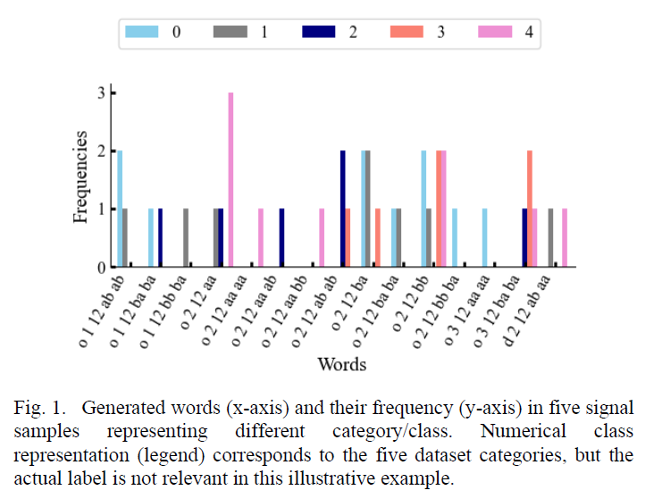
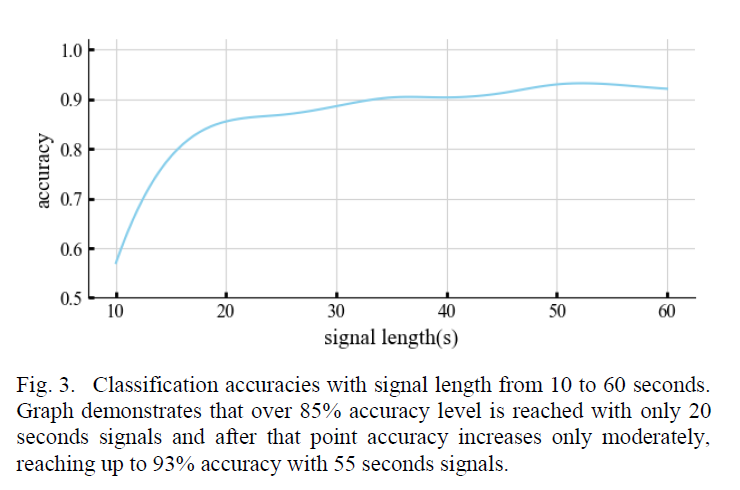
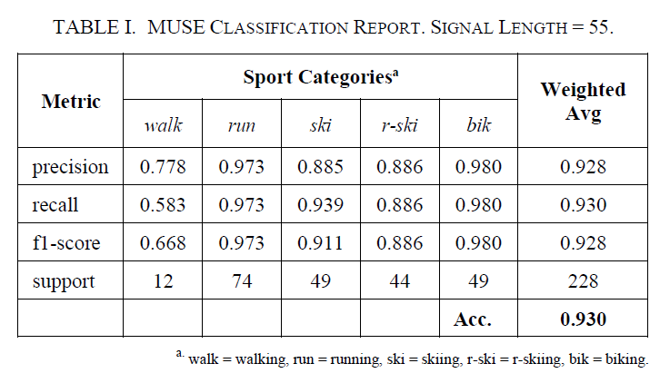
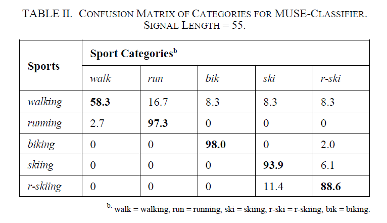
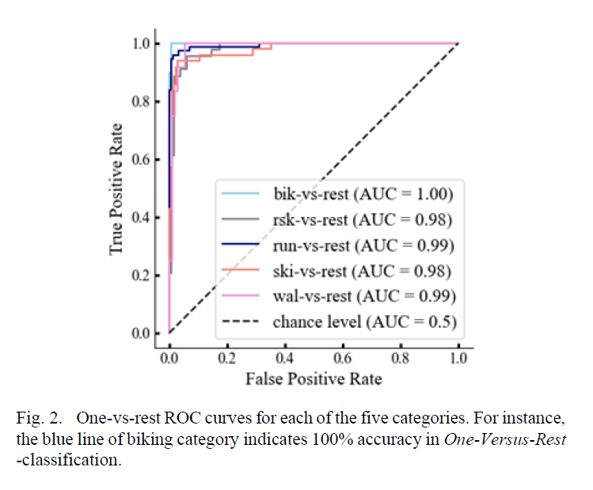

# Classification of Outdoor Sports using Symbolic Fourier Transform of Multivariate Time Series

## ⚠️ Research Showcase Notice
> **Note:** This repository serves as technical documentation for a research paper co-authored and published at the **Ural Federal University**. Due to the proprietary nature of the dataset and collaborative IP rights, the raw source code is not public. This documentation outlines the methodology, algorithmic approach, and experimental results.

---

## 📌 Project Overview
**Human Activity Recognition (HAR)** in uncontrolled environments remains a challenge due to signal noise and variability. This study leverages a **Multivariate Time Series (MTS)** dataset to classify 5 outdoor sports activities: *Walking, Running, Biking, Skiing, and Roller-Skiing*.

Instead of traditional feature extraction or deep learning, we applied the **WEASEL+MUSE** algorithm (Multivariate Unsupervised Symbols and Derivatives), which utilizes **Symbolic Fourier Approximation (SFA)** to capture temporal characteristics.

### Key Objectives
*   To classify complex activities using 3D features: **Heart Rate, Speed, and Altitude**.
*   To evaluate the efficiency of **Symbolic Fourier Transform** in HAR.
*   To optimize data usage using **Early Time Series Classification (TEASER)**.

---

## 🧠 Methodology: The WEASEL+MUSE Algorithm
The core of this project is the **MUSE** algorithm. Unlike standard classifiers, MUSE transforms time-series data into a "Bag of Patterns" (words) using symbolic representation.

### How it works:
1.  **Transformation:** Converts time series into **Symbolic Fourier Approximation (SFA)** words.
2.  **Discretization:** Applies Multiple Coefficient Binning (MCB).
3.  **Classification:** Learns a logistic regression classifier on the histogram of these "words".

*(Figure 1: Visualization of generated words and their frequency for different activity classes)*

---

## ⚙️ Optimization & Signal Analysis
We performed a **Signal Length Analysis** using the **TEASER** algorithm to find the optimal trade-off between accuracy and computational cost.

*   **Finding:** Using only **33% of the data** (20-second segments) yielded **85.6% accuracy**.
*   **Result:** The model reached **93% accuracy** with 55-second signals.

*(Figure 3: Classification accuracy vs. Signal Length. Demonstrating rapid convergence).*

---

## 📈 Experimental Results
The model demonstrated high integrity and robustness, particularly distinguishing between "Running" and "Biking" with near-perfect accuracy.

### 1. Classification Report
The weighted average F1-Score reached **0.93**, with high precision across most categories.

*(Table I: MUSE Classification Report)*

### 2. Confusion Matrix
The matrix reveals that the model effectively separated distinct activities. The primary challenge was distinguishing between *Skiing* and *Roller-Skiing* due to their kinematic similarities.

*(Table II: Confusion Matrix. Note the high diagonal values indicating correct predictions)*

### 3. ROC-AUC Analysis
To further validate the model, we conducted a Receiver Operating Characteristic (ROC) analysis. The Area Under Curve (AUC) scores were exceptional (near 1.00 for Biking).

*(Figure 2: One-vs-rest ROC curves for the five categories)*

---

## 💻 Tech Stack
*   **Language:** Python
*   **Algorithms:** WEASEL+MUSE, TEASER (Early Classification)
*   **Libraries:** `pyts` (Python Time Series), `sktime`, `scikit-learn`, `matplotlib`
*   **Data Type:** Multivariate Time Series (MTS)

